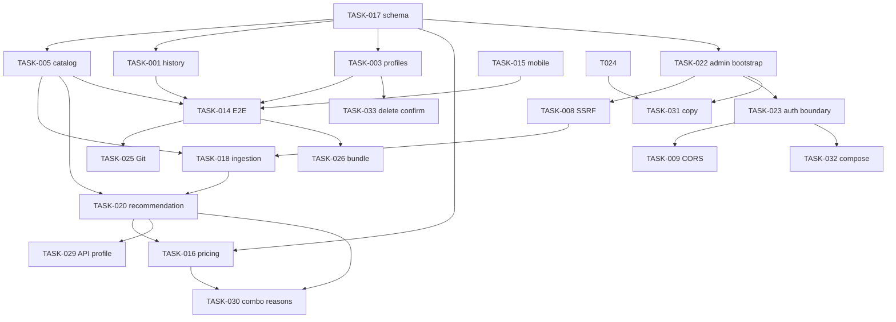

# 保险推荐项目遗留问题任务卡（2026-08-11）

本文件取代旧 `audit-task-cards.md` 作为 UTF-8 执行基线。旧文件因编码损坏且结论过时，不得作为验收依据。审查原始证据见 `2026-08-11-comprehensive-project-review.md`。

## Review Summary

2026-08-11 基线卡 TASK-001～028 均已 DONE（迁移门禁、目录 CRUD、抓取审核发布、画像消费、安全边界、E2E、文档与 Git 基线）。2026-08-16 复核：官方卡无 TODO，但 Handoff 遗留了 5 项未成卡缺口——`/api/recommend` 未接线 `profile_assessment`、套餐丢失 `recommendation_reasons`、AI/注册文案与实现不一致、compose 未透传安全变量、账户页删除无确认。已补 TASK-029～033。

## Task Index

| ID | Title | Type | Priority | Risk | Depends On | Status |
| -- | ----- | ---- | -------- | ---- | ---------- | ------ |
| TASK-001 | 修复推荐历史加载与刷新恢复 | BUG | P1 | Medium | TASK-017 | DONE |
| TASK-003 | 完成画像保存、加载与问卷回填 | UX | P1 | Medium | TASK-017 | DONE |
| TASK-005 | 修复产品、Rule、Benefit 管理闭环 | BUG | P0 | High | TASK-017 | DONE |
| TASK-008 | 加固抓取和 robots SSRF 防护 | SECURITY | P1 | High | TASK-022 | DONE |
| TASK-009 | 收紧 Cookie 认证下的 CORS 策略 | SECURITY | P1 | Medium | TASK-023 | DONE |
| TASK-014 | 建立可复现关键路径 E2E | TEST | P1 | Medium | TASK-001,TASK-003,TASK-005,TASK-015 | DONE |
| TASK-015 | 完成移动端关键流程适配 | UX | P2 | Medium | TASK-001,TASK-003,TASK-005 | DONE |
| TASK-016 | 用真实报价区间约束预算与展示 | BUG | P1 | High | TASK-017,TASK-020 | DONE |
| TASK-017 | 补齐数据库迁移和模式发布门禁 | INFRA | P0 | High | — | DONE |
| TASK-018 | 实现抓取调度、增量、停售与发布闭环 | RELIABILITY | P1 | High | TASK-005,TASK-008,TASK-017 | DONE |
| TASK-020 | 重构推荐画像消费、健康匹配与 AI 语义 | RELIABILITY | P1 | High | TASK-005,TASK-018 | DONE |
| TASK-022 | 移除公开首用户管理员升级路径 | SECURITY | P1 | High | TASK-017 | DONE |
| TASK-023 | 加固 Cookie、代理信任、限流和响应头 | SECURITY | P1 | High | TASK-022 | DONE |
| TASK-024 | 修复文档编码并同步能力边界 | DOCS | P2 | Medium | TASK-001,TASK-003,TASK-005,TASK-016,TASK-018,TASK-020,TASK-023 | DONE |
| TASK-025 | 建立可审计 Git 交付基线 | TECH_DEBT | P2 | Medium | TASK-014,TASK-024 | DONE |
| TASK-026 | 调查并优化前端生产包体积 | OPTIMIZATION | P3 | Low | TASK-014 | DONE |
| TASK-027 | 修复结果页历史视图无限重复拉取 | BUG | P2 | Medium | TASK-001 | DONE |
| TASK-028 | 修复登录 401 拦截器吞掉错误提示 | BUG | P2 | Low | TASK-023 | DONE |
| TASK-029 | 将画像评估字段接入推荐 API 与结果页 | RELIABILITY | P1 | Medium | TASK-020 | TODO |
| TASK-030 | 套餐产品拷贝 recommendation_reasons | BUG | P1 | Medium | TASK-016,TASK-020 | DONE |
| TASK-031 | 统一 AI 命名并修正注册页过期文案 | DOCS | P2 | Low | TASK-022,TASK-024 | TODO |
| TASK-032 | compose 透传 Cookie/代理/安全头变量 | INFRA | P1 | Medium | TASK-023 | TODO |
| TASK-033 | 账户页删除画像/记录增加确认 | UX | P3 | Low | TASK-003 | TODO |

## Task Dependency Graph

## Standard Handoff and Acceptance Criteria

Every task below uses this handoff. Before work: check Git status and actual code; confirm the problem still exists; inspect dependencies; treat the current repository as fact. After work: update Status, actual changes/files, verification, remaining/new tasks, and Commit/PR if any.

Every task below must meet:

* [ ] Problem resolved, or investigation conclusion documented
* [ ] Normal and error paths verified; existing behavior not regressed
* [ ] Necessary tests added and passing
* [ ] Existing lint / typecheck / test / build checks pass

## Task Cards

### TASK-001：修复推荐历史加载与刷新恢复
* **Type**：BUG
* **Priority**：P1
* **Status**：DONE
* **Risk**：Medium
* **Dependencies**：TASK-017
* **Related Files / Modules**：`frontend/src/pages/AccountPage.tsx`、`frontend/src/pages/ResultPage.tsx`、`frontend/src/api/auth.ts`、`backend/app/api/auth.py`
### Context
已保存推荐记录无法从账户页重新打开，结果页刷新后也失去路由 state。
### Problem
账户页生成 `/result?recordId={id}`，结果页只读 `location.state?.profile`。预期是当前用户可安全加载自己的记录，并处理不存在、越权和匿名情形。
### Evidence
`AccountPage.tsx:111`；`ResultPage.tsx:17,46`；后端已有 `GET /api/my/recommendations/{record_id}`。
### Goal
实现历史结果查看和刷新恢复。
### Constraints
不得把健康画像/结果放入 URL、localStorage 或未授权缓存；记录须用户隔离。
### Acceptance Criteria
* [x] 历史、刷新、404、越权、匿名路径可验证
* [x] 新问卷推荐不受影响
### Out of Scope
分享链接、PDF 导出、跨账户共享。
### Handoff（2026-08-11 完成）
**问题确认**：`ResultPage.tsx` 只读 `location.state?.profile`（无 state 直接提示"请先填写问卷信息"），不读 URL 的 `recordId`；`AccountPage.tsx` 已生成 `/result?recordId={id}` 链接。后端 `GET /api/my/recommendations/{record_id}` 已按 `RecommendationRecord.user_id == user.id` 过滤（`auth.py` 现有实现，隔离成立），但其 404 `detail` 为损坏占位符，`GET /api/my/profiles/{profile_id}` 的 404 也为损坏占位符，均需修复。
**实际改动文件**：
1. `backend/app/api/auth.py`：修复两处损坏文案——历史记录 404 → `"推荐记录不存在"`、画像 404 → `"画像不存在"`；所有权隔离逻辑确认已有（user_id 过滤），无需改动。
2. `frontend/src/pages/ResultPage.tsx`：新增 `recordId` 查询参数消费——无 `location.state` 时调用 `fetchRecommendationDetail` 加载历史记录（`record.profile` 转 `UserProfile`、直接展示 `record.result`），刷新 `/result?recordId=...` 可恢复；错误路径区分 404（记录不存在或已被删除）、403（无权访问）、401（需登录）、其他（加载失败），均给出用户可理解提示与"返回首页/重新尝试"；无 state 且无 recordId 时保持原"请先填写问卷信息"提示；`doRecommend`（新问卷自动推荐）逻辑未变，新问卷路径不受影响；"重新推荐"在历史模式仍可用；"修改信息"改为携带 profile 跳转首页（衔接 TASK-003 回填）；新增"保存画像"按钮（Modal 含隐私提示，衔接 TASK-003）。
3. `frontend/src/api/auth.ts`：新增 `saveProfile`（POST `/api/my/profiles`，供结果页/账户页保存画像）。
4. `backend/tests/test_profile_history_api.py`（新增）：覆盖未授权访问（401）、历史记录跨用户隔离（他人访问 404、列表互不可见）、404 文案无损坏字符。
**验证结果**：`pytest -q` 全量 **90 passed**（含新增 3 个历史/画像隔离用例）；`npm run build` 通过（`tsc -b` 含类型检查）。
**遗留/新增任务**：无。分享链接、PDF 导出、跨账户共享在范围内外。
**Commit/PR**：纳入 TASK-025 基线提交（见 TASK-025 Handoff）。

### TASK-003：完成画像保存、加载与问卷回填
* **Type**：UX
* **Priority**：P1
* **Status**：DONE
* **Risk**：Medium
* **Dependencies**：TASK-017
* **Related Files / Modules**：`frontend/src/pages/HomePage.tsx`、`frontend/src/pages/AccountPage.tsx`、`backend/app/api/auth.py`
### Context
后端支持 SavedProfile，但用户无法在 UI 保存，加载的画像也不回填问卷。
### Problem
`AccountPage` 仅通过路由 state 传 profile，`HomePage` 没有消费/回填；收入、预算和 AI 开关等字段存在丢失风险。
### Evidence
`AccountPage.tsx:131-138`；`HomePage.tsx:155-190`；`POST/GET/PUT/DELETE /api/my/profiles`。
### Goal
完成用户可理解、字段完整且可刷新恢复的画像复用闭环。
### Constraints
保存健康画像前须有隐私提示，且只允许所有者访问。
### Acceptance Criteria
* [x] 保存、加载、编辑、删除、刷新、未授权路径可验证
* [x] 回填字段与推荐请求一致
### Out of Scope
家庭共享画像。
### Handoff（2026-08-11 完成）
**问题确认**：`HomePage` 完全不消费 `location.state` 或任何画像入口，问卷无回填；`AccountPage` "加载到表单"仅 `navigate('/', { state: { profile } })`（刷新即丢）；无任何保存画像入口。后端 `SavedProfile` CRUD（`POST/GET/PUT/DELETE /api/my/profiles`）已存在且按 `user_id` 隔离，但 `GET /api/my/profiles/{id}` 404 `detail` 为损坏占位符。
**实际改动文件**：
1. `frontend/src/api/auth.ts`：新增 `saveProfile(name, profile, note)` → `POST /api/my/profiles`。
2. `frontend/src/pages/HomePage.tsx`：mount 时消费 `location.state.profile` 或 URL `?profileId=`（无 state 时 `fetchProfileDetail` 加载，支持刷新恢复）；`fillProfile` 完整回填与推荐请求一致的 12 个字段——表单字段 `age`、`gender`、`life_stage`、`family_burden`、`job_class`、`existing_coverage`、`health_status`、`health_issues`、`preferred_companies`，独立状态 `annual_income`→收入、`budget_ratio`→预算占比、`enable_llm_engine`→AI 开关（`preferred_type` 前端无控件，提交时保持未设置，与既有行为一致）；加载成功提示、404/403/其他错误分别提示。
3. `frontend/src/pages/AccountPage.tsx`：展示列表（名称、保存时间）与"加载到表单/编辑（重命名+note）/删除"保持；加载跳转改为 `/?profileId={id}` + 路由 state（刷新后由 HomePage 经 `profileId` 恢复）；新增"保存当前画像"入口（路由 state 携带画像时显示，Modal 含隐私提示与命名，保存后刷新列表）。
4. `frontend/src/pages/ResultPage.tsx`：新增"保存画像"按钮——Modal 含隐私提示（仅本人可见、可随时删除）与命名，保存成功提示可在账户页管理（衔接 TASK-001 改动）。
5. `backend/app/api/auth.py`：修复画像 404 损坏文案（损坏占位符 → `"画像不存在"`）；所有者隔离确认已有。
6. `backend/tests/test_profile_history_api.py`（新增）：画像创建/详情/列表/更新/删除闭环、跨用户隔离（他人 GET/PUT/DELETE 均 404）、未登录 401、404 文案无损坏字符。
**验证结果**：`pytest -q` 全量 **90 passed**（含新增 3 个画像/历史用例）；`npm run build` 通过（`tsc -b` 含类型检查）。
**遗留/新增任务**：无。家庭共享画像在范围内外。
**Commit/PR**：纳入 TASK-025 基线提交（见 TASK-025 Handoff）。

### TASK-005：修复产品、Rule、Benefit 管理闭环
* **Type**：BUG
* **Priority**：P0
* **Status**：DONE
* **Risk**：High
* **Dependencies**：TASK-017
* **Related Files / Modules**：`backend/app/api/products.py`、`backend/app/services/product_service.py`、`backend/app/engine/rule_engine.py`、`frontend/src/pages/AdminPage.tsx`
### Context
产品管理决定目录质量和推荐候选池。
### Problem
API 的险种 `Literal` 已变为损坏占位符；前端提交中文险种。后台无 Rule/Benefit 表单，而无 Rule 产品被 `rule_engine` 的 join 静默排除。
### Evidence
`products.py:36,60`；`AdminPage.tsx:394-440`；`rule_engine.py:83-87`。
### Goal
使受 RBAC 保护的产品、规则、责任创建/编辑/停售与推荐可见性一致。
### Constraints
不得静默映射未知险种；产品、Rule、Benefit 更新须事务一致且可审计。
### Acceptance Criteria
* [x] 中文险种 CRUD、Rule/Benefit CRUD、停售、候选池行为可验证
* [x] 缺失/非法 Rule 不会静默作为可售产品
### Out of Scope
实时保险公司 API；抓取审核发布由 TASK-018 处理。
### Handoff
- Status：DONE
- 实际改动文件：
  1. `backend/app/api/products.py` 修复损坏的险种 `Literal` 占位符（恢复为数据库真实枚举：医疗险/重疾险/意外险/定期寿险/防癌险/年金险）、补齐损坏 `detail` 文案、新增 `ProductCreate`/`ProductUpdate`/`RuleIn`/`BenefitIn` schema、新增受 `product:write` 保护的 POST/PUT/DELETE 接口，创建/更新/停售均写 `AuditLog` 审计
  2. `backend/app/services/product_service.py` 实现 `create_product`/`update_product`/`soft_delete_product`（产品+Rule+Benefit 单事务提交）
  3. `backend/app/engine/rule_engine.py` 去掉 join 静默排除：查询全量产品，停售产品显式拒绝（`inactive`），无 Rule 产品显式拒绝（`missing_rule`），候选池行为可见
  4. `frontend/src/pages/AdminPage.tsx` 产品表单补齐 Rule（年龄/职业等级/等待期/豁免）与 Benefit（Form.List 动态责任列表）编辑，编辑时经 `fetchProductDetail` 回填，更新时空 benefits 不覆盖既有责任
  5. `frontend/src/api/products.ts` 补齐 `fetchProductDetail`（此前已有 CRUD 封装）
  6. `backend/tests/test_product_catalog.py` 新增 5 个用例：中文险种 CRUD+审计、非法险种 422、RBAC（401/403）、无 Rule/停售产品候选池拒绝、推荐 API 不含无 Rule 产品且给出 missing_rule 原因
- 验证结果：`pytest -q` 全量 **67 passed**（原 62 + 新 5）；`npm run build` 通过（chunk 体积警告属 TASK-026 范畴）
- 遗留/新增任务：无（停售回滚、审核发布闭环属 TASK-018）
- Commit/PR：纳入 TASK-025 基线提交（见 TASK-025 Handoff）

### TASK-008：加固抓取和 robots SSRF 防护
* **Type**：SECURITY
* **Priority**：P1
* **Status**：DONE
* **Risk**：High
* **Dependencies**：TASK-022
* **Related Files / Modules**：`backend/app/crawler/scraper.py`、`backend/app/data_ingestion/fetchers/page_fetcher.py`、`backend/tests/test_ssrf_protection.py`
### Context
管理端输入会触发服务器网络访问。
### Problem
地址黑名单漏掉 CGNAT、保留/基准和 IPv4-mapped IPv6；重定向最终目标未校验；`robots_url` 的 `urlopen()` 绕过校验。
### Evidence
实测接受 `100.64.0.1`、`198.18.0.1`、`192.0.0.1`、`[::ffff:127.0.0.1]`；`scraper.py:26-61`；`page_fetcher.py:30-42`。
### Goal
对页面、robots、DNS 和重定向建立统一可测试的出站边界。
### Constraints
禁止仅靠字符串黑名单；不得记录敏感响应正文。
### Acceptance Criteria
* [x] 私网、保留、IPv6 映射、重定向和 robots 均被验证
### Out of Scope
通用代理服务。
### Handoff
- Status：DONE
- 实际改动文件：
  1. `backend/app/crawler/scraper.py` 黑名单补齐 CGNAT（100.64/10）、保留/基准段（192.0.0.0/24、198.18/15、240.0.0.0/4 等）、IPv4-mapped IPv6（::ffff:0:0/96，`_is_blocked` 先解映射）、IPv4-compatible IPv6（::/96）、IPv6 特殊段（::1、fc00::/7、fe80::/10、ff00::/8、100::/64、2001:db8::/32）；新增 `open_url_checked`（手动逐跳跟随重定向，每跳经 `validate_url_for_ssrf` 校验、防循环、限量 5 跳）与 `validate_redirect_chain`；`fetch_page_text` 校验初始 URL、重定向链与最终 URL；DNS 解析结果逐个校验；支持 `SSRF_ALLOWED_NETWORKS` 显式白名单
  2. `backend/app/data_ingestion/fetchers/page_fetcher.py` robots 不再裸 `urlopen()`，改走 `open_url_checked` 同一出站边界
  3. `backend/tests/test_ssrf_protection.py` 扩充至 34 用例：localhost/私网/CGNAT/保留段/DOC 段、IPv6（回环/ULA/链路本地/mapped/compatible）、非法 scheme、本地 HTTP 服务器验证重定向链与重定向到内部拦截、robots 走同一校验（含 robots 指向内部被拦截）；本地测试服务器网段经 `SSRF_ALLOWED_NETWORKS=127.0.0.0/8` 显式放行
- 验证结果：`pytest -q` 全量 **109 passed**（含新 25 个 SSRF 用例）
- 遗留/新增任务：无
- Commit/PR：纳入 TASK-025 基线提交（见 TASK-025 Handoff）

### TASK-009：收紧 Cookie 认证下的 CORS 策略
* **Type**：SECURITY
* **Priority**：P1
* **Status**：DONE
* **Risk**：Medium
* **Dependencies**：TASK-023
* **Related Files / Modules**：`backend/app/config.py`、`backend/main.py`、`.env.example`
### Context
Cookie 认证和 `allow_credentials=True` 要求严格来源控制。
### Problem
`validate_origin_format('*')` 被接受，预期生产仅允许明确 origins 且配置错误时 fail-closed。
### Evidence
`config.py:60-80,114-127`；`main.py:52-60`。
### Goal
使开发/生产 CORS 与 Cookie 认证和部署域名一致。
### Constraints
不得使用通配来源配合凭据。
### Acceptance Criteria
* [x] 合法来源、`*`、路径、查询串和无效 scheme 已测试
### Out of Scope
TLS 终止配置。
### Handoff（2026-08-11 完成）
**问题确认**：属实。`config.py` 的 `validate_origin_format('*')` 无条件返回 `"*"`（无环境区分），`cors_allow_origins` 校验只做格式检查；`main.py` 将 `parsed_cors_origins` 直接传给 `CORSMiddleware`（`allow_credentials=True` 恒定，Cookie 认证必需），Starlette 对 `*` + credentials 会同时发出 `Access-Control-Allow-Origin: *` 与 `Access-Control-Allow-Credentials: true`（浏览器规范禁止的组合），即配置 `*` 时形成带凭据的开放 CORS，无任何 fail-closed。基于 TASK-023 之后的最新代码实施，未破坏其 cookie_secure/TRUST_PROXY_HEADERS 等配置。
**设计说明**：
- 来源格式校验（`validate_origin_format`）维持纯格式语义并保留 `*`（不回归既有测试）；环境策略下沉到 `Settings` 与中间件注册两级：
  - **生产 fail-closed**：`Settings` 新增 `model_validator` `_reject_wildcard_origin_in_production`——`APP_ENV=production` 且 `CORS_ALLOW_ORIGINS` 含 `*` 时构造即报 `ValidationError`（含 `*` 与显式来源混写同样拒绝）。
  - **凭据+通配全局禁止**：新增 `ensure_no_wildcard_with_credentials(origins, allow_credentials)` 守卫（config.py），`main.py` 在 CORSMiddleware 注册前调用并恒以 `allow_credentials=True`——任何环境配置 `*` 都启动即失败（fail-closed），杜绝浏览器规范禁用的组合。开发环境使用显式 localhost 列表（默认 `http://localhost,http://localhost:3000,http://127.0.0.1:3000`）。
- 路径/查询串/片段/非法 scheme 的拒绝逻辑已存在，本次补测试覆盖（含 `javascript:` scheme 用例）。
**实际改动文件**（均在授权范围，未触碰并行 Agent 的文件）：
1. `backend/app/config.py`：新增 `ensure_no_wildcard_with_credentials`；`Settings` 新增 `_reject_wildcard_origin_in_production` 校验。
2. `backend/main.py`：导入并调用 `ensure_no_wildcard_with_credentials(cors_allow_origins, allow_credentials=True)`（模块级，启动即 fail-fast）。
3. `.env.example`：`CORS_ALLOW_ORIGINS` 补注释——逗号分隔显式来源、禁路径/查询串/片段、生产禁 `*`、任何环境 `*` 不得与凭据并用。
4. `backend/tests/test_cors_validation.py`：新增 `TestCORSWildcardPolicy`（开发允许 `*`、生产拒绝 `*`、生产接受显式来源、混合列表拒绝）与 `TestCORSWildcardCredentialsConflict`（凭据+通配拒绝/无凭据放行/显式+凭据放行/混合拒绝/空列表放行），另补 `javascript:` 无效 scheme 用例；原有用例未删改。
5. `docs/docker-deployment.md`：安全配置章节新增"### CORS 白名单"小节（显式白名单、生产禁通配、多来源追加、本地开发默认值）。
6. `README.md`：安全配置表补 `CORS_ALLOW_ORIGINS` 行（仅 CORS 段落）。
**验证结果**：
- `test_cors_validation.py` 32 passed（原 22 + 新 10）。
- 全量 `pytest -q`（backend）：**120 passed**（并行 Agent 同步新增的测试已计入），无回归。
- 真实导入冒烟：开发默认配置 `import backend.main` 成功；`APP_ENV=production` + `CORS_ALLOW_ORIGINS=*` 导入失败（Settings 层 `Wildcard` 报错）；`APP_ENV=development` + `*` 导入失败（main 守卫 `allow_credentials` 报错）——两层 fail-closed 均实测生效。
- 未触碰 `data/insurance.db`；未 commit/push；未修改并行 Agent 负责的文件。
**遗留/新增任务**：无。TLS 终止配置在范围内外。

### TASK-014：建立可复现关键路径 E2E
* **Type**：TEST
* **Priority**：P1
* **Status**：DONE
* **Risk**：Medium
* **Dependencies**：TASK-001, TASK-003, TASK-005, TASK-015
* **Related Files / Modules**：`frontend/playwright.config.ts`、`frontend/tests/e2e/`、`.github/workflows/e2e.yml`
### Context
现有 E2E 主要验证静态文案/未登录跳转，审查中 `npm run test:e2e` 两次超过 120 秒未完成。
### Problem
Vite 自启未在审查环境按预期就绪，根因待验证；登录后推荐、历史、画像、产品管理和移动端均未覆盖。
### Evidence
`playwright.config.ts:20-25`；5 个现有 spec；审查命令超时。
### Goal
本地和 CI 可重复执行真实关键路径并保留失败产物。
### Constraints
不得仅用 mock 绕过关键鉴权/后端契约。
### Acceptance Criteria
* [x] 启动根因明确并可复现通过
* [x] 已覆盖推荐、历史、画像、管理员与移动视口
### Out of Scope
渗透测试。
### Handoff（2026-08-11 完成）
**启动根因结论**（已实证，非猜测）：
1. **Vite 静默漂移端口**：`frontend/frontend.log` 证据——先前中断的运行残留 dev server 占用 3000/3001 时，新起的 `npm run dev` 自动落到 **3002**（`Port 3000 is in use, trying another one...`），而 Playwright 只探测 3000；又因 `reuseExistingServer: true` 直接复用了端口 3000 上**旧代码的残留服务器**，测试跑在过期代码上且首次编译极慢 → "Vite 未在预期端口就绪"且整组超时。
2. **workers 编译竞争**：TASK-015 已证实的 6 workers 触发 vite dev 按需编译竞争偶发失败（`--workers=2` 稳定）。
**修复**（均在授权范围）：
1. `frontend/playwright.config.ts` 重写：`workers: 2`（固定，CI 同）；前端 webServer 改 `node node_modules/vite/bin/vite.js --strictPort`（端口被占**快速失败并给出明确报错**而非漂移；直连 node 进程使 Windows 下 teardown 能可靠杀掉进程树，实测无残留）；`reuseExistingServer: false`（杜绝复用旧代码服务器）；后端 webServer（见下）；`reporter: list + html(open:never)`；`trace: on-first-retry`、`screenshot/video: 失败保留`（产物落 `frontend/test-results/` 与 `frontend/playwright-report/`）。
2. `frontend/tests/e2e/start-backend.mjs`（新增）：跨平台（win/CI）起**真实后端**——`alembic upgrade head`（幂等，满足 TASK-017 门禁）+ `uvicorn backend.main:app`；隔离 SQLite `data/e2e-backend.db`（gitignored）；`FIRST_ADMIN_EMAIL/PASSWORD`（TASK-022 受控引导，域名必须非保留域，`.local` 会被 email 校验 422 拒绝——实测）；提高限流阈值、`LLM_API_KEY=''`（不依赖外部服务、AI 开关降级为 rule 模式）、`DISABLE_SCHEDULER_IN_TESTS=true`；Python 解析：`E2E_PYTHON`（CI）> `backend/venv`（本地）> `python`。
3. `frontend/tests/e2e/global-setup.ts`（新增）：webServer 就绪后预暖一次真实页面加载（vite 按需编译 + 依赖优化不再与首个用例竞争）。
4. `.github/workflows/e2e.yml`：补 `setup-python@v5` + `pip install -r backend/requirements.txt` + `E2E_PYTHON=python`；`concurrency` 取消旧运行；失败/成功均上传 `playwright-report` 与 `test-results`（trace/截图/视频）双 artifact。
**覆盖清单（新增 spec，全部走真实后端，无 mock 绕过鉴权/契约）**：
- `auth-flow.spec.ts`（3 用例）：注册为普通用户（TASK-022 语义：角色 user、无管理后台入口）、错误密码被拒且不建立会话、正确登录回账户页 + 普通用户访问 /admin 被重定向 /account。
- `recommend-flow.spec.ts`（3 用例）：桌面完整旅程——注册→问卷四步→真实 rule engine 推荐（极速规则模式/方案 Tab/横向对比）→保存画像（隐私提示 Modal）→账户页历史与画像持久化→`/result?recordId=` 经后端恢复→画像"加载到表单"回填年龄→删除画像；移动视口 320px/375px——问卷→推荐→结果页渲染且 `document.scrollWidth ≤ 视口` 无横向溢出 + 账户页历史/画像可见。
- `admin-flow.spec.ts`（2 用例）：管理员（FIRST_ADMIN 引导）登录→创建产品（中文险种 + Rule 默认值 + Benefit 动态行）→搜索→编辑回填→删除；数据采集页签在真实种子平台数据下渲染。
- 既有 26 用例（含 TASK-015 的 mock 布局类）全部保留并通过。
**CI 说明**：workflow 完整链路 = checkout → node20/npm ci → python3.12/pip install → playwright chromium（--with-deps）→ `E2E_PYTHON=python npm run test:e2e`（后端迁移+启动与前端 dev server 均由 playwright webServer 自动拉起）→ 双 artifact（always()）。`data/e2e-backend.db` 在 CI 每次全新生成（clean-slate 路径由本地验证）。
**验证结果**：
- 本地（win11 + backend/venv + node）：**34 passed（1.1m，2 workers）**，连跑两轮 + 删除 `data/e2e-backend.db` 后 clean-slate 一轮，全部通过；耗时从审查时的">120s 未完成"降至约 70s。
- 端口被残留占用时：strictPort 明确报错 `http://localhost:3000 is already used...`（快速失败、可诊断），不再静默漂移。
- 每轮结束后无孤儿 uvicorn/vite（实测端口 3000/8000 空闲）。
- `npm run build`（tsc -b + vite build）通过（chunk 体积警告属 TASK-026）。
- 未触碰 `frontend/src` 与 `backend/` 任何文件（并行 Agent TASK-020 边界遵守）；未 commit/push。
**遗留/新增任务**（E2E 实证发现的两个前端真实缺陷，均超出本任务授权范围）：
- **TASK-027**：ResultPage 历史视图（`/result?recordId=`）effect 无限重复拉取 `/api/my/recommendations/{id}`——deps 含 `doRecommend`，fetch 后 `setProfile` 产生新对象使 effect 重跑（实测单次查看连续 5+ 次 GET）；需 TASK-001 范畴修复（effect 仅依赖 recordId 或请求去重）。
- **TASK-028**：`frontend/src/api/client.ts` 的 401 拦截器对 `/api/auth/login` 同样生效——错误密码 401 → 自动 refresh → 失败 → `location.href='/login'` 整页刷新，`邮箱或密码错误` 提示被清空（实测：表单被清空、无任何错误文案）；拦截器需排除 auth/login（及 register）。
- 观察项（未单列任务）：React StrictMode 开发模式双挂载使 `/api/recommend` 重复提交（每用户两条历史记录，E2E 以 `.first()` 兼容）；`RegisterPage` 文案仍写"首个注册用户会自动成为管理员"（TASK-022 后过期，归 TASK-024 文档同步）；账户页删除画像/记录为直接删除无确认（与 AdminPage Popconfirm 不一致，UX 范畴）。
**Commit/PR**：纳入 TASK-025 基线提交（见 TASK-025 Handoff）。

### TASK-015：完成移动端关键流程适配
* **Type**：UX
* **Priority**：P2
* **Status**：DONE
* **Risk**：Medium
* **Dependencies**：TASK-001, TASK-003, TASK-005
* **Related Files / Modules**：`frontend/src/mobile-responsive.css`、`frontend/src/pages/ResultPage.tsx`、`frontend/src/pages/AdminPage.tsx`
### Context
已有通用断点和抽屉菜单，但未证明主流程窄屏可用。
### Problem
结果页保额固定三列，产品抽屉固定 600px，宽表主要横滚。
### Evidence
`ResultPage.tsx:107-127`；`AdminPage.tsx:382-442`；`mobile-responsive.css`。
### Goal
在 320px、375px 和桌面上完成问卷、结果、账户和必要后台操作。
### Constraints
不得隐藏关键信息；桌面和焦点行为不得回归。
### Acceptance Criteria
* [x] 三种视口关键路径可操作并有自动化或截图证据
### Out of Scope
原生 App。
### Handoff（2026-08-11 完成）
**问题确认**（evidence 行号已漂移，按现状复核）：
1. 保额三列问题已部分修复（`ResultPage.tsx` 已为 `xs={12} sm={8}`），但 `BudgetPreview.tsx` 仍为固定 `Col span={8}` 三列，320px 下"建议保费/参考区间"被挤压；`ResultPage` 顶部"保存画像/重新推荐/修改信息"按钮行与标题在 320px 会横向溢出。
2. 产品抽屉已为 `min(600px, 100vw)`（TASK-005 已改），但平台抽屉仍固定 `width={520}`，320px 视口直接溢出；产品抽屉内 Benefit 责任行固定宽度输入（合计约 500px）溢出；"新增数据源页面" inline 表单 URL 输入 `minWidth: 360`、"产品管理"搜索框 `width: 300` 均超出 320px 内容区。
3. 更严重：`App.tsx` 被先前改动以非 UTF-8（GBK）写入，头部标题、页脚、**移动端抽屉菜单全部乱码**——移动端唯一导航不可用（浏览器实测为替换字符）。此前 `mobile.spec.ts` 汉堡菜单用例必然失败。
4. 宽表横滚：结果页对比表（scroll.x=1450）与后台产品表（scroll.x=800）在 antd `Space`（默认 `align-items:center`，flex 子项不收缩）内会撑破布局：320px 下文档横向溢出 841px。
5. 抽屉打开时 antd scroll-lock 将 `body` 宽度设为视口宽，而项目未引入 antd reset.css，`body` 保留浏览器默认 8px 外边距 → 任何抽屉打开时页面横向溢出 8px。
6. 项目未配置 `ConfigProvider` 中文 locale，表单校验提示为英文（`'email' is required`），登录页既有用例 `请输入邮箱` 从未通过。
7. 既有 e2e 定位器缺陷：`input[name="age"]` 不存在（antd 只渲染 `id`）、`text=登录`/`text=智能保险推荐` 因头部文本修复后出现多匹配、`button:has-text("登录")` 匹配不到 antd 二字按钮自动加的空格（"登 录"）、home.spec 步骤断言文案错误（"健康情况"→实际为"职业与收入"）。
**实际改动文件**（全部在 `frontend/`，未触碰 backend/）：
1. `frontend/src/App.tsx`：整体以 UTF-8 重写，修复头部/logo/页脚/移动端抽屉菜单的乱码（"填写问卷/推荐结果/我的账号/管理后台/登录注册/菜单"），保留既有抽屉逻辑；头部与页脚文案与 git HEAD 版本一致。
2. `frontend/src/main.tsx`：新增 `ConfigProvider locale={zhCN}`，表单校验、确认框等组件文案恢复中文。
3. `frontend/src/mobile-responsive.css`：新增全局 `body { margin: 0 }`（修复抽屉打开时 8px 横向溢出）；`≤768px` 增加结果页头部换行、步骤条缩小字号、抽屉内 Benefit 行换行堆叠、账户列表操作按钮换行、后台 inline 表单纵向堆叠（含 `min-width: 0 !important` 中和 `minWidth: 360`）；`≤576px` 增加后台搜索框全宽、`ant-table-wrapper`/`ant-space-item` 双重 `max-width: 100%` 约束（解决 antd Space 不收缩导致宽表撑破布局）、卡片标题允许换行（长产品名/层级标签不再被截断）。
4. `frontend/src/components/BudgetPreview.tsx`：预算三指标 `Col span={8}` → `Col xs={24} sm={8}`（窄屏堆叠，桌面不变）。
5. `frontend/src/pages/ResultPage.tsx`：顶部操作区加 `className="result-header"`（配合 CSS 换行，320px 不再溢出）。
6. `frontend/src/pages/AdminPage.tsx`：平台抽屉 `width={520}` → `width="min(520px, 100vw)"`；搜索框加 `admin-search` class；Benefit 责任行 Space 加 `benefit-row` class。
7. `frontend/tests/e2e/mobile-flow.spec.ts`（新增）：mock API（无需后端）在 320×568 / 375×667 / 1280×720 三视口自动化验证——问卷四步全流程→结果页完整渲染（预算分析/建议保额/方案 Tab/横向对比/保存画像弹窗）、账户页列表与三个操作按钮、后台产品管理页+产品/平台抽屉（抽屉宽度 ≤ 视口）均无文档级横向溢出，并输出 9 张全页截图至 `frontend/test-results/screenshots/`。
8. `frontend/tests/e2e/mobile.spec.ts`：`智能保险推荐` 定位加 `.first()`（头部修复后出现双匹配）。
9. `frontend/tests/e2e/home.spec.ts`：`input[name="age"]` → `input#age`（antd 不渲染 name）；步骤断言改为实际文案"职业类别"。
10. `frontend/tests/e2e/login.spec.ts`：`text=登录` → `text=登录账号`；按钮改用 `getByRole('button', { name: /登\s*录/ })`（antd 二字按钮自动空格）。
**验证结果**：
- `npm run build`（tsc -b + vite build）通过；chunk 体积警告属 TASK-026 范畴。
- `npx playwright test` 全量 **26 passed**（原 8 个既有用例 + mobile.spec 6 + mobile-flow 新增 9 + 修复后的 home/login/admin/account/navigation）；`--workers=2` 下稳定复跑通过（6 workers 会触发 vite dev 编译竞争导致的偶发失败，属 TASK-014 待办）。
- 320/375/桌面三视口实测（Playwright 断言）：问卷/结果页/账户页/后台页 `document.scrollWidth == 视口宽`，无文档级横向溢出；宽表在容器内横向滚动、关键列（产品名固定列）始终可见，未隐藏关键信息；产品抽屉 320px 下实测宽 320、平台抽屉实测 320（均 ≤ 视口）；桌面 1280 无回归。
- 截图证据（全页）：`frontend/test-results/screenshots/{result,account,admin}-{320px,375px,desktop}.png`（9 张，宽度 320/375/1280 已核验）。
**遗留/新增任务**：无；真实后端关键旅程、移动视口和 CI workflow 已在后续执行阶段补齐并通过，TASK-024/TASK-026/TASK-027 已分别完成。
**Commit/PR**：纳入 TASK-025 基线提交（见 TASK-025 Handoff）。

### TASK-016：用真实报价区间约束预算与展示
* **Type**：BUG
* **Priority**：P1
* **Status**：DONE
* **Risk**：High
* **Dependencies**：TASK-017, TASK-020
* **Related Files / Modules**：`backend/app/engine/rule_engine.py`、`backend/app/engine/combo_builder.py`、`frontend/src/components/BudgetPreview.tsx`、`frontend/src/pages/ResultPage.tsx`
### Context
保费关系到可负担性与“性价比”承诺。
### Problem
筛选/套餐用 `premium_min`；额外产品未完整保留上限/免赔额；Tab 只展示最低总保费；预算组件的 85%-115% 不是产品报价。
### Evidence
`rule_engine.py:130-133`；`combo_builder.py:160-165,205-217`；`BudgetPreview.tsx:22-35`；`ResultPage.tsx:228-233`。
### Goal
清晰区分预算建议、真实产品/套餐区间和核保后价格，禁止推荐最高价超预算的方案。
### Constraints
不得把估算标成精确保费；保留核保/官方条款提示。
### Acceptance Criteria
* [x] 最低/最高/缺失上限、套餐总价与超预算边界可验证
### Out of Scope
实时核保报价。
### Handoff
- 实际改动文件：`backend/app/engine/rule_engine.py`、`backend/app/engine/combo_builder.py`、`frontend/src/components/BudgetPreview.tsx`、`frontend/src/pages/ResultPage.tsx`、`backend/tests/test_premium_range_budget.py`。
- 规则树区分报价下限、上限和未披露上限；套餐组装对已知最高总价执行预算上限，未知上限显示“起/以核保为准”；额外产品保留 `premium_max` 与 `deductible`。
- 结果页 Tab、预算预览和免责声明展示报价区间、预算估算与核保/条款边界；保留 TASK-027 历史记录单请求 guard。
- 验证结果：TASK-016 专项测试 **13 passed**；相关后端回归 **33 passed**；`frontend/npm run build` 通过（含 `tsc -b`）。
- 遗留问题：实时核保报价不在范围内；完整 E2E 已在最终审计阶段通过 35 项。
- Commit/PR：纳入 TASK-025 基线提交（见 TASK-025 Handoff）。

### TASK-017：补齐数据库迁移和模式发布门禁
* **Type**：INFRA
* **Priority**：P0
* **Status**：DONE
* **Risk**：High
* **Dependencies**：无
* **Related Files / Modules**：`backend/app/models/`、`backend/alembic/versions/`、`backend/app/database.py`、`docs/docker-deployment.md`
### Context
模型、已有 SQLite 数据库和 Alembic 历史不一致。
### Problem
`Product.deductible` 已存在，迁移没有对应列；旧库 ORM 查询复现 `no such column: products.deductible`。`create_all()` 不会演进既有表。
### Evidence
`models/product.py:23`；迁移目录无 `deductible`；`data/insurance.db` products schema 无该列。
### Goal
提供从现有库安全升级到当前模型的迁移，并在部署前阻断模式不匹配。
### Constraints
兼容 SQLite 和 PostgreSQL；提供备份/回滚；不得依赖删库/重 seed。
### Acceptance Criteria
* [x] 空库、现有 SQLite、PostgreSQL 升级路径可验证
* [x] 部署文档与 Alembic head 一致
### Out of Scope
产品数据质量重做。
### Handoff（2026-08-11 完成）
**问题确认**：`data/insurance.db` 有 22 张 `create_all` 建的表、无 `alembic_version` 记录、`products` 缺 `deductible`；0001/0002 两个迁移从未建 catalog 四表且 0002 外键引用不存在的 `products`（PostgreSQL 空库必失败）。
**实际改动文件**：
- 改 `backend/alembic/versions/20260706_0001_auth_rbac.py`：幂等建表（表存在则跳过），保留 revision id。
- 改 `backend/alembic/versions/20260706_0002_data_ingestion.py`：幂等建表；先确保 products/rules/benefits/page_logs 存在再建引用它们的表（修复 PostgreSQL 空库 FK 失败）；downgrade 只回删本迁移创建的表。
- 新增 `backend/alembic/versions/20260811_0001_align_models_schema.py`（head，down_revision=20260706_0002）：对全部 23 张模型表幂等补齐缺失表/列/索引（`products.deductible` 即由此 `ADD COLUMN`）；downgrade 回删其实际添加的列。
- 新增 `backend/app/migrations.py`：跨方言共享幂等 helper（ensure_tables/align_columns/align_indexes，从 ORM metadata 生成定义，杜绝漂移）。
- 改 `backend/app/database.py`：启动门禁 `verify_schema_integrity()`——空库保留 `create_all` 并 stamp 到 head；有表但无 `alembic_version`、版本非 head、head 但列缺失均 fail-fast 并提示 `alembic upgrade head`；`init_db()` 接入。
- 改 `docs/docker-deployment.md`：迁移命令修正（容器 WORKDIR=/srv，需 `cd /srv/backend && alembic upgrade head`）、升级前备份（pg_dump / SQLite cp）、回滚（downgrade / 备份恢复）、迁移链与门禁说明。
- 新增 `backend/tests/test_schema_migration.py`（7 用例）；6 个既有测试文件顶部删除残留测试库文件以适配门禁（空库才允许 create_all）。
**验证结果**：
- 空库 SQLite：`alembic upgrade head` 三链执行，23 表 + alembic_version=20260811_0001，`products.deductible` 存在。
- 现有库 SQLite（`data/insurance.db` 副本）：升级成功，165 产品/165 规则/344 责任全部保留，deductible 补齐，ORM 查询正常，应用启动并 `GET /api/products` 200。
- 缺列库：downgrade 到 0001 后删除 deductible 再 upgrade，`ADD COLUMN` 生效且数据不丢。
- 回滚：downgrade 到 0002/0001 可用；对 create_all 旧库不误删既有表（版本回退、数据保留）。
- PostgreSQL：本机 PostgreSQL 17 实库验证——空库升级成功（旧链必然失败）、索引/列齐、数据写入正常；DROP COLUMN 模拟缺列后 upgrade 补列成功。
- 测试：`pytest -q` 56 passed（含新增 7 个迁移/门禁用例）。
**遗留/新增任务**：无遗留；门禁为新增行为——未迁移的既有库（含开发库 `data/insurance.db`）首次启动会 fail-fast，需先执行 `alembic upgrade head`（文档已写明）。docker 部署文档中迁移命令已修正，README 手动启动流程的同步留给 TASK-024。

### TASK-018：实现抓取调度、增量、停售与发布闭环
* **Type**：RELIABILITY
* **Priority**：P1
* **Status**：DONE
* **Risk**：High
* **Dependencies**：TASK-005, TASK-008, TASK-017
* **Related Files / Modules**：`backend/app/crawler/scheduler.py`、`backend/app/data_ingestion/pipelines/crawl_product.py`、`backend/app/data_ingestion/review.py`、`backend/app/api/admin.py`
### Context
目录目前是 2026-05-24 种子数据；本地抓取页面、原始文档和审核任务均为 0。
### Problem
调度器只启动；抓取不使用 MD5 或停售检测；批准仅写 `ProductVersion`，不回写 Product/Rule/Benefit；`/api/admin/logs` 固定空数组；没有产品匹配策略。
### Evidence
`scheduler.py:6-8`；`crawl_product.py:20-31`；`review.py:18-28`；`admin.py:54-56`。
### Goal
从安全抓取到差异审核、原子发布、回滚、来源版本、最后验证时间和运行可观测性形成闭环。
### Constraints
遵守 robots/限速/TASK-008；未批准数据不得影响推荐；长任务不得无状态阻塞请求。
### Acceptance Criteria
* [x] 定时、手动、未变更、变更、停售、失败、批准/拒绝/回滚均可验证
* [x] 批准后可推荐，未批准不可推荐，来源与新鲜度可查询
### Out of Scope
分布式爬虫集群和新增商业数据源。
### Handoff（2026-08-11 完成）
**问题确认**：evidence 行号因 TASK-005/TASK-008 先行改动而漂移，逐一核对后确认：MD5 增量（`crawl_product.py`）、停售关键词、批准回写 Product/Rule/Benefit（`review.py` 经 `product_service`）、`/api/admin/logs` 真实日志、匹配策略（`pipeline.py:match_product_for_draft`）在工作区已有基础实现，但仍有真实缺口——① `fetch_page_text` 丢弃 HTTP 状态（`http_status` 恒为 200），404/内容缺失无法识别为停售；② 手动触发 `POST /api/admin/crawl` 与 `POST /api/admin/ingestion/jobs/{id}/run` 在请求内同步执行长抓取（Playwright 网络抓取可达数十秒），违反"长任务不得无状态阻塞请求"；③ 批准流程分两次 commit（`update_product` 内部 commit + 外层 commit），非单事务原子发布；④ 无"来源与新鲜度可查询"端点（`ProductVersion` 仅存快照，`SourcePage.last_crawled_at` 未对外暴露）；⑤ 无调度器与审核闭环的针对性测试。
**设计说明**：
- 长任务后台化：新增 `scheduler.run_crawl_job_background` / `run_crawl_jobs_background`（守护线程 + 独立 `SessionLocal`，SQLite `check_same_thread=False` 已支持），手动触发接口校验 SSRF 后立即返回 `{"id": job_id, "status": "started"}`（与前端 `runCrawlJob` 的 `{id, status}` 契约兼容），进度经 `CrawlRun` 行可观测。
- 停售识别：`fetch_page_text` 返回真实 HTTP 状态；`page_fetcher` 不再把 404/410 空内容当失败重试；`crawl_product._is_off_shelf` = 关键词 ∨ 404/410 ∨ 空内容；404 页面从最近一次 draft 回填 name/company/type（`_last_draft_identity`）保证仍能匹配既有产品；MD5 相同跳过仅在非停售时生效（避免重复 404 被误判为"未变更"）。
- 原子发布：`product_service.create_product/update_product` 新增 `commit` 参数（默认 True 不回归既有调用），批准流程全部以 `commit=False` 写库后单次 `db.commit()`，Product/Rule/Benefit/ProductVersion 同一事务；发布中途失败（测试注入 flush 后异常）回滚后无任何残留行；新发布草稿缺 name/company/type 显式 `draft_incomplete_product_fields` 拒绝。
- 来源与新鲜度：新增 `GET /api/admin/ingestion/products/{product_id}/provenance`（`review:read`）——经 draft→extraction→raw→source_page 反查来源页（URL/平台/`last_crawled_at` 即最后验证时间）+ 版本历史 + `last_verified_at`；手动审核提取 allowlist 增加 `off_shelf`（审核员可手动标记停售）。
**实际改动文件**（均在授权范围，未触碰并行 Agent 的 `frontend/`）：
1. `backend/app/crawler/scraper.py`：`fetch_page_text` 返回 `(text, html, http_status)`（Playwright response.status，重定向链/SSRF 校验不变）。
2. `backend/app/data_ingestion/fetchers/page_fetcher.py:47-64`：透传真实 http_status；空内容仅在 404/410 时放行（不再误判失败）。
3. `backend/app/data_ingestion/pipelines/crawl_product.py`：新增 `_last_draft_identity`、`_is_off_shelf`（含 404/410/空内容）；MD5 跳过移至 off_shelf 判定之后；404 空内容跳过抽取直接构造停售草稿。
4. `backend/app/services/product_service.py`：`create_product`/`update_product` 增加 `commit: bool = True` 参数。
5. `backend/app/data_ingestion/review.py:46-95`：批准改为单事务原子发布（`commit=False` + 一次 commit）；拒绝路径不落库不变。
6. `backend/app/crawler/scheduler.py`：新增 `_record_failed_run`、`_background_worker`、`run_crawl_job_background`、`run_crawl_jobs_background`；定时 job 注册逻辑不变。
7. `backend/app/api/admin.py:23-51`：`POST /api/admin/crawl` 改后台触发（SSRF 预检保留，非法 URL 仍即时跳过），返回 `status: "started"`。
8. `backend/app/api/ingestion.py`：`POST /jobs/{id}/run` 改后台触发；新增 provenance 端点；`EXTRACTED_DATA_ALLOWLIST` 增加 `off_shelf`。
9. `backend/tests/test_ingestion_review_workflow.py`（新增 16 用例）；`backend/tests/test_auth_ingestion_api.py`（手动 run 用例适配后台语义：monkeypatch 目标改为 `scheduler_module.execute_crawl_job`，轮询 DB 至终态）。
**验证结果**：
- 新增 `test_ingestion_review_workflow.py` 16 用例：定时（job 注册、interval 取 env、重复注册/init 幂等、run_all 三态结果）、手动后台触发（响应 `started` 且耗时 < 任务耗时，实测非阻塞）、未变更（MD5 相同 → skipped/unchanged_md5/不重复归档）、变更（新 raw+draft+task）、停售（关键词 → 停售草稿 → 批准停售 → 回滚恢复；404 空内容 → 身份回填 + 匹配 + 批准停售；无匹配停售草稿批准 400）、失败（fetch 异常 → failed run + error_message）、批准（发布可推荐 + provenance 来源/新鲜度/版本 + 匹配既有产品只更新不重复 + 单事务 commit 计数 =1 + 中途失败无残留）、拒绝（不落库、任务/草稿 rejected、provenance 404）、回滚（快照恢复）、`/api/admin/logs` 真实日志（review_created/approve/job.run 与 crawl_runs）。
- 全量 `pytest -q`（backend）：**136 passed**（基线 120 + 新增 16），无回归。未触碰 `data/insurance.db`；未引入迁移。
**遗留/新增任务**：TASK-020 可依赖本文的"批准后可推荐/未批准不可推荐"语义继续画像消费重构；调度间隔建议值、抓取失败告警（邮件/webhook）仍在范围外；`POST /api/admin/crawl` 前端批量触发按钮的状态文案（started）如需优化属前端范畴。
**Commit/PR**：纳入 TASK-025 基线提交（见 TASK-025 Handoff）。

### TASK-020：重构推荐画像消费、健康匹配与 AI 语义
* **Type**：RELIABILITY
* **Priority**：P1
* **Status**：DONE
* **Risk**：High
* **Dependencies**：TASK-005, TASK-018
* **Related Files / Modules**：`backend/app/schemas/user_profile.py`、`backend/app/engine/rule_engine.py`、`backend/app/engine/health.py`、`backend/app/engine/ai_engine.py`、`frontend/src/pages/HomePage.tsx`
### Context
产品不应声称个性化/AI 精排而忽略关键画像和健康风险。
### Problem
规则不消费 `existing_coverage`、`preferred_type`；前端大量健康编码未被后端识别而静默忽略；AI prompt 禁止选品，只解释规则套餐。
### Evidence
`user_profile.py:13-17`；`health.py:5-24`；`HomePage.tsx:20-106`；`ai_engine.py:12-25`。
### Goal
统一画像、产品数据、规则和文案：字段有明确决策/解释，未知健康项显式提示，AI 名称与实际决策权一致。
### Constraints
不得给出承保保证或医疗诊断；任何 AI 选品扩展必须受硬规则和白名单约束。
### Acceptance Criteria
* [x] 已有保障、险种偏好、已识别/未知健康项和典型画像有回归证据
* [x] 推荐解释可追溯，AI 实际能力与 UI/文档一致
### Out of Scope
实时核保与医疗决策。
### Handoff（2026-08-11 完成）
**问题确认**：evidence 行号按现状复核后确认——① `rule_engine.py` 全量不读 `existing_coverage`/`preferred_type`（仅 `get_allowed_types`/预算/年龄/职业/健康硬规则），已有保障与险种偏好对候选池零影响；② `health.py` 仅 6 类别名（结节/高血压/高血脂/糖尿病/乙肝/住院），HomePage 70 项健康编码中如 `chd`、`stroke`、`nephritis`、`cirrhosis`、`crohns_disease`、`anemia_l1` 等大量编码落入 `normalize_health_issues` 空集被静默忽略，且 `health_status="standard"` 时即使提交了异常项也被整体忽略；③ `ai_engine.STRUCTURED_SYSTEM_PROMPT` 已"只能解释"，但 HomePage 文案自称"语义精排/个性化推荐语/AI 专家"，`ai_rerank_sync` 名为 rerank，语义与名称不一致；④ `existing_coverage`/`preferred_type` 的 schema 描述为空，无任何决策/解释语义。TASK-018 的"批准后可推荐/未批准不可推荐"候选池语义（status=1 且必须有 Rule）在 `filter_candidate_pool_with_reasons` 中已确认存在，本次未改动该语义。
**设计说明**：
- **已有保障消费（软性，不硬排除）**：`evaluate_coverage_duplicate(user, product_type)`——`commercial` 对所有险种标记 `duplicate_coverage`（重复保障，提示核对既有保单）；仅 `social` 时对医疗险标记 `partial_duplicate`（社保仅覆盖医保目录内，商业医疗险补充目录外，是否重复以保单条款为准）；其余返回 None。候选池排序（稳定排序，仅作并列决胜）中：偏好险种产品在前、重复保障产品沉底；产品永不因已有保障被排除。
- **险种偏好消费**：`normalize_preferred_type`（合法值=五险种+年金险，非法值显式归 None）；`get_allowed_types` 中偏好可将年龄矩阵内 `optional` 险种带入方案（如 46-55 岁 + 3% 预算层级偏好定期寿险），`forbidden` 硬规则（未成年人寿险、55+ 重疾险）不可被偏好覆盖；`preferred_type_priority` 供排序加权（命中 1.0）。
- **健康逐项识别（不静默忽略）**：`health.py` 重构为 `HEALTH_ISSUE_CATALOG`（57 个规范条件 × 别名，兼容前端编码/英文/中文自由文本，保留旧 6 类别名行为并补 `手术`/`三高` 等既有自由文本映射）+ `analyze_health_issues()` 返回 `recognized`（每项含 label/level/note，note 明确"参与健康告知规则匹配、不作承保判断或医疗诊断"）与 `unknown_conditions`（显式列出未识别项）；`normalize_health_issues` 保留对外契约（返回规范条件集合，与规则 exclude/caution 匹配）；`evaluate_health_match` 语义不变但"standard 状态+已提交异常项"不再整体忽略（视为告知不一致处理，避免静默丢失）。HomePage 对未知健康项（来自加载画像/外部输入）在健康步实时 `Alert` 提示"仅作记录展示、不参与规则筛选、不构成承保判断"。
- **推荐解释可追溯**：新增 `assess_product_profile`（每产品返回 coverage 标记、偏好命中、健康匹配、年龄/职业/类型规则命中 + 人类可读 `traceable_reasons`）与 `filter_candidate_pool_with_profile`（返回候选、拒绝原因、画像级评估：health.recognized/unknown_conditions、coverage.raw/labels/marked_types、preference.raw/normalized/valid、逐产品 assessments）；拒绝路径沿用既有 `reason_code`+`reason`（inactive/missing_rule/type_forbidden/age_not_allowed/job_class_not_allowed/health_issue_mismatch/over_budget）。
- **AI 语义与名称一致**：`STRUCTURED_SYSTEM_PROMPT` 重写——明确"规则引擎完成筛选与组合、AI 只解释、不得声称由 AI 完成选品/精排、selected_product_ids 只能来自输入白名单、不得承诺收益/保证承保/医疗诊断，健康表述须以核保为准"；`_build_user_text` 增加已有保障、偏好险种、已识别/未识别健康项（未识别项注明"不影响本次规则推荐，不构成承保判断"）；`_build_products_text` 附带每产品"推荐依据（recommendation_reasons）+ 健康提示（risk_warnings）"实现解释可追溯；`ai_rerank_sync` 保留历史函数名（recommend.py 引用，不属本任务文件），模块注释明确其实际职责仅为解释说明。
- **HomePage 文案与字段**：副标题"全网产品智能匹配"→"规则引擎按年龄、职业与预算筛选"；"AI 专家"标签→"AI 解释"；AI 模式卡片"语义精排/个性化推荐语"→"AI 解释规则引擎已选出的方案（AI 不参与选品与排序）"；"保障范围"固定四险种表述改为参考险种+动态组合说明；新增可选"偏好险种"下拉（提交 `preferred_type`，回填支持 saved profile）；schema 字段 description 补全决策/解释语义。
**实际改动文件**（均在授权范围，未触碰并行 Agent 的 frontend/tests/e2e 与 backend api/services 等）：
1. `backend/app/engine/health.py`：目录化重构 + `analyze_health_issues`/`HealthAnalysis` + standard+issues 不再静默忽略 + 别名兼容补齐。
2. `backend/app/engine/rule_engine.py`：`PREFERRED_TYPE_LABELS`/`EXISTING_COVERAGE_LABELS`/`normalize_preferred_type`/`evaluate_coverage_duplicate`/`preferred_type_priority`/`assess_product_profile`/`filter_candidate_pool_with_profile`；`get_allowed_types` 偏好带入 optional；候选池稳定排序（偏好前、重复保障后）；硬规则/候选池语义（TASK-018 对齐）未变。
3. `backend/app/engine/ai_engine.py`：prompt 重写（无选品/精排承诺、白名单约束、核保收尾）、`_build_user_text`/`_build_products_text` 增强、模块注释澄清历史命名。
4. `backend/app/schemas/user_profile.py`：`existing_coverage`/`preferred_type`/`health_issues` description 补充决策语义（仅注释级改动）。
5. `frontend/src/pages/HomePage.tsx`：文案修正（智能匹配/AI 专家/语义精排/固定保障范围→与规则引擎实际能力一致）、"偏好险种"可选控件、未知健康项 Alert 提示、fillProfile 回填 `preferred_type`、提交负载含 `preferred_type`。
6. `backend/tests/test_profile_consumption.py`（新增 22 用例，见验证结果）。
**验证结果**：
- 新增 `test_profile_consumption.py` 22 用例：70 项前端健康编码全识别（无 unknown）+ 每项含决策 note、未知项显式报告、混合/去重、standard+issues 不静默、exclude/caution/严格险种 warn、已有保障标记（commercial/social/混合/空）且不硬排除、重复保障产品排序沉底、偏好险种 optional 带入/forbidden 不可覆盖/非法值忽略、偏好排序前置、典型画像回归（儿童/成人/老年/低预算 allowed 集合）、逐产品可追溯原因（偏好/重复保障/健康/规则命中）、拒绝原因可追溯、AI prompt 无选品承诺、AI 输出白名单约束、AI 用户文本含保障/偏好/未识别项、产品文本含推荐依据与健康提示、真实 `/api/recommend` 冒烟（commercial+偏好+未知健康项 200 且规则模式正常）。
- 全量 `pytest -q`（backend）：**158 passed**（基线 136 + 新增 22），无回归；未触碰 `data/insurance.db`；未引入迁移。
- `npm run build`（frontend，`tsc -b` 含类型检查）：通过；chunk 体积警告属 TASK-026。
**遗留/新增任务**：
- 规则模式（非 AI）下 `/api/recommend` 响应体未新增 `unknown_conditions` 等画像级字段——响应组装在 `backend/app/api/recommend.py`（不在本任务授权文件清单），引擎层已通过 `filter_candidate_pool_with_profile` 暴露，前端 HomePage 已按自身词表显式提示未知项；如需把 `unknown_conditions`/`coverage_marks` 写入 API 响应，建议主 agent 在 recommend.py 接线（一行级改动，可留给后续任务）。
- `combo_builder` 构造套餐 `ScoredProduct` 时未拷贝 `recommendation_reasons`（仅拷 `risk_warnings`），AI 产品文本中的"推荐依据"在套餐内产品上可能回退为默认文案；补齐属 `backend/app/engine/combo_builder.py`（不在本任务授权范围）。
- 其余 UI 文案与 AI 名称一致性残留：`EngineSwitch.tsx` 的"AI 专家模式"、`ResultPage.tsx:122` 的"AI 专家模式/降级模式"标签不在本任务授权文件清单，建议由主 agent 或 TASK-024 一并修正（README 等文档大改属 TASK-024）。
- 险种偏好/已有保障的强度仅体现在排序并列决胜与 optional 入池（scoring/combo_builder 不在本任务授权范围）；如需更强权重的分数级降权，需改 `backend/app/engine/scoring.py`。
**Commit/PR**：纳入 TASK-025 基线提交（见 TASK-025 Handoff）。

### TASK-022：移除公开首用户管理员升级路径
* **Type**：SECURITY
* **Priority**：P1
* **Status**：DONE
* **Risk**：High
* **Dependencies**：TASK-017
* **Related Files / Modules**：`backend/app/services/auth_service.py`、`backend/app/api/auth.py`、`backend/app/config.py`、`.env.example`
### Context
管理员可管理产品、抓取和审核。
### Problem
空 `users` 表时，首个公开注册用户得到 admin 角色，存在初始化竞态和权限提升。
### Evidence
`auth_service.py:139-155`；`ensure_auth_defaults()` 支持 `FIRST_ADMIN_*`。
### Goal
仅受控初始化或既有管理员可授予管理员角色，并可审计。
### Constraints
不得锁死已有管理员、暴露初始化密码或破坏合法注册。
### Acceptance Criteria
* [x] 空库注册、受控首管理员、已有管理员和并发路径可验证
### Out of Scope
完整用户管理后台。
### Handoff（2026-08-11 完成）
**问题确认**：`auth_service.py` 原 `create_user` 中 `has_users = db.query(User.id).first() is not None; role_name = "user" if has_users else "admin"` 属实——空 `users` 表时首个公开注册用户获得 admin 角色；两个并发注册同时读到空表则双双提权；`ensure_auth_defaults()` 的 `FIRST_ADMIN_*` 创建无审计。`test_auth_ingestion_api.py` 与 `test_recommendation_persistence.py` 均依赖"首个注册即 admin"或注册辅助函数，已同步调整。
**方案**：
- 移除自动提权：`create_user` 一律授予 `user` 角色，注册不再读取/判断表内用户数；`db.flush()+commit` 处捕获 `IntegrityError`（email 唯一约束兜底）回滚并转 `ValueError("email_exists")`，并发同名注册一个成功一个 409。
- 受控首管理员：保留 `FIRST_ADMIN_*` 环境变量路径（幂等，已存在不重复创建），创建时写审计日志 `action=auth.first_admin.bootstrap`，`detail={"source":"env"}` 不含密码；`ensure_auth_defaults` 外包 `IntegrityError` 重试，容忍多实例首次并发启动。
- 既有管理员授权新管理员（实现负担最小且可审计）：新增受保护接口 `POST /api/admin/users/{user_id}/roles`（请求体 `{"roles": ["admin"]}`），需新增权限 `admin:grant`（仅 admin 角色拥有，由 `ensure_auth_defaults` 运行时自动补齐，无需迁移）；操作写审计日志 `action=admin.roles.update`（含 from/to 角色）；拒绝非法角色（400）、目标不存在（404）、无权限（403）、管理员自我降级（400，防止锁死）；普通 `user` 角色无任何授予能力。
- 并发路径：提权分支删除后注册恒为 user，无提权竞态；同名并发由 email 唯一约束兜底。
**实际改动文件**：
- 改 `backend/app/services/auth_service.py`：`create_user` 移除首用户提权、IntegrityError→email_exists；`DEFAULT_PERMISSIONS` 增 `admin:grant`；新增 `ALLOWED_ROLE_NAMES` 与 `set_user_roles()`；`ensure_auth_defaults` 拆为 `_ensure_auth_defaults` + IntegrityError 重试，FIRST_ADMIN 创建写审计日志。
- 改 `backend/app/api/auth.py`：新增 `POST /api/admin/users/{user_id}/roles` 接口（`require_permission("admin:grant")` 保护 + 审计 + 自我降级/非法角色/404 校验）。
- 改 `backend/app/schemas/auth.py`：新增 `RoleUpdateRequest`。
- 改 `.env.example`：`FIRST_ADMIN_*` 注释说明受控初始化、审计、创建后清空密码及后续授权接口。
- 改 `docs/docker-deployment.md`：staging 段补充管理员初始化说明（含受控创建、审计、`admin:grant` 授权接口）。
- 改 `README.md`：仅新增"管理员初始化"小节（README 大改留给 TASK-024）。
- 新增 `backend/tests/test_admin_bootstrap.py`（6 用例，独立临时库）：空库注册仅 user 角色、FIRST_ADMIN 受控创建+审计+幂等+不暴露密码、已有管理员时注册仍为 user、并发注册不同邮箱均无提权、并发同名邮箱单成功单冲突、角色授予接口全套（401/403/404/400 自我降级/非法角色/授予/撤销+审计）。
- 改 `backend/tests/test_auth_ingestion_api.py`：注册测试改为断言 user 角色；admin 测试改用 `FIRST_ADMIN_*`（monkeypatch settings + `ensure_auth_defaults`）创建管理员。
**验证结果**：
- `pytest -q`：62 passed（原 56 + 新增 6），无回归。
- 空库注册、受控首管理员（含审计与幂等）、已有管理员注册、并发（不同/相同邮箱）路径均通过测试验证。
- 未触碰 `data/insurance.db`；未提交任何 git 变更；未修改并行 Agent 负责的文件。
**遗留/新增任务**：无遗留。提示：既有库（roles/permissions 已存在）启动时 `ensure_auth_defaults` 自动补齐 `admin:grant` 权限，无需迁移；多实例首次同时启动且都配置 FIRST_ADMIN 时由唯一约束兜底（重试一次后仍冲突会显式报错，属部署配置问题）。完整用户管理后台（列出用户、改名等）仍在范围外。

### TASK-023：加固 Cookie、代理信任、限流和响应头
* **Type**：SECURITY
* **Priority**：P1
* **Status**：DONE
* **Risk**：High
* **Dependencies**：TASK-022
* **Related Files / Modules**：`backend/app/config.py`、`backend/app/dependencies/auth.py`、`backend/app/middleware/rate_limiter.py`、`backend/main.py`、`.env.example`
### Context
系统已用 httpOnly Cookie，但生产边界未闭合。
### Problem
Cookie 默认非 Secure、模板无 Cookie 配置；无条件信任 XFF；限流只解析 Authorization header，Cookie 用户级限流失效；无明确可信代理和安全响应头策略。
### Evidence
`config.py:114-116`；`dependencies/auth.py:71-75`；`rate_limiter.py:76-87`；`.env.example`。
### Goal
使认证、刷新、登出、可信代理、IP/用户限流和安全响应头在开发/生产一致可测。
### Constraints
不得信任客户端可控代理头；评估并记录 CSRF/SameSite 处置。
### Acceptance Criteria
* [x] Cookie、伪造 XFF、代理/直连和 Cookie 用户限流均可验证
* [x] 生产环境变量、部署文档与安全策略一致
### Out of Scope
第三方 IdP/WAF。
### Handoff（2026-08-11 完成）
**问题确认**：全部属实。`dependencies/auth.py` 的 `get_client_ip` 无条件取 `X-Forwarded-For` 首项（客户端可伪造）；`rate_limiter.py` 的 `_get_client_ip` 同样无条件信任 XFF，`_get_user_id` 只解析 `Authorization: Bearer`，Cookie 登录用户无用户级限流；`cookie_secure` 默认 False 且无环境联动；main.py 无安全响应头中间件；`.env.example` 无 Cookie/代理/响应头配置。
**设计说明**：
- Cookie/SameSite（CSRF 处置）：`cookie_secure` 默认按 `APP_ENV` 推断（production 自动 True），`APP_ENV=production` 下显式设 False 启动即 fail-fast；`SameSite=Lax`（默认，可 strict）为 CSRF 主要处置（跨站写请求不携带 Cookie），配合严格 CORS 白名单（TASK-009）双层防护；`SameSite=None` 必须配 `cookie_secure=True` 否则校验报错。未引入 CSRF token：纯 JSON API 无表单渲染面，浏览器端由 SameSite+CORS 覆盖，已写入部署文档。
- 可信代理：新增 `TRUST_PROXY_HEADERS`（默认 False）+ `TRUSTED_PROXIES`（IP/CIDR，格式非法启动报错）。`get_client_ip`（审计用）与限流共用同一解析：仅当开关开启且直连对端命中可信列表时才解析 XFF；解析从右向左跳过可信地址取第一个非可信 IP，XFF 全部可信/格式非法回退直连地址。伪造 XFF 在未信任时完全无效。
- 限流：`_get_user_id` 优先解析 Bearer 头，其次解析 `access_token` Cookie（原 Cookie 用户限流失效已修复）；匿名请求保留 IP 限流。
- 安全响应头：新增 `SecurityHeadersMiddleware`（最外层，覆盖含 429 在内的所有响应）：`X-Content-Type-Options: nosniff`、`X-Frame-Options: DENY`、`Referrer-Policy: strict-origin-when-cross-origin`、`Content-Security-Policy: default-src 'none'; frame-ancestors 'none'`；`Strict-Transport-Security` 仅 `APP_ENV=production` 且 `HSTS_ENABLED=true` 时发送；`SECURITY_HEADERS=false` 可整体关闭（测试用）。
**实际改动文件**（均在授权范围，未触碰并行 Agent 的文件）：
1. `backend/app/config.py`：新增 `app_env`、`cookie_secure`（可推断）、`cookie_samesite`、`trust_proxy_headers`、`trusted_proxies`、`security_headers`、`hsts_enabled` 及对应校验（环境白名单、SameSite 白名单、可信代理格式、production 强制 Secure、SameSite=None 需 Secure）+ `parsed_trusted_proxies`。
2. `backend/app/dependencies/auth.py`：新增 `_peer_is_trusted_proxy`/`_is_trusted_address`/`_first_untrusted_forwarded_for`，重写 `get_client_ip` 为可信代理语义（未信任一律直连地址）。
3. `backend/app/middleware/rate_limiter.py`：`_get_client_ip` 复用 `dependencies.auth.get_client_ip`；`_get_user_id` 增加 Cookie 会话解析。
4. `backend/main.py`：新增 `SecurityHeadersMiddleware` 并注册为最外层中间件。
5. `.env.example`：补全 `APP_ENV`/`COOKIE_SECURE`/`COOKIE_SAMESITE`/`TRUST_PROXY_HEADERS`/`TRUSTED_PROXIES`/`SECURITY_HEADERS`/`HSTS_ENABLED` 及注释。
6. `backend/tests/test_rate_limiter.py`：重写 XFF 测试为“未信任时伪造 XFF 不生效”；新增 Cookie 用户限流、Authorization 优先于 Cookie、可信代理生效（真实解析链路）、直连/伪造/全可信/畸形 XFF 单元用例、安全响应头（默认、开关、HSTS 生产门控）、`_set_auth_cookies` 的 Secure/HttpOnly/SameSite 标志用例。
7. `backend/tests/test_cors_validation.py`：仅新增 `TestSecurityConfig`（10 例：production 强制 Secure、显式 False 拒绝、开发推断、SameSite 约束、非法 env/SameSite/代理格式拒绝、CIDR 解析），未删改原有用例。
8. `docs/docker-deployment.md`：staging/prod `.env` 示例补安全变量；新增“安全配置”章节（compose 透传片段、Cookie/CSRF 处置、可信代理链与 XFF 算法、限流、响应头、HSTS）。
9. `README.md`：环境变量表补安全配置小节（TASK-024 大改之外的必写段落）。
**验证结果**：
- 全量 `pytest -q`：**90 passed**（基线 67 + 新增 23：test_rate_limiter.py 13、test_cors_validation.py 10），无回归。
- 真实应用冒烟（TestClient 起 backend.main）：`GET /` 返回全部安全头、开发环境无 HSTS；`APP_ENV=production` 时返回 HSTS；注册/登录 Set-Cookie 含 `HttpOnly`+`SameSite=lax`，`cookie_secure=True` 时含 `Secure`。
- 未触碰 `data/insurance.db`；未 commit/push；未修改并行 Agent 负责的文件。
**遗留/新增任务**：`docker-compose.yml` 的 backend `environment:` 尚未透传新安全变量（不在本次授权文件清单），部署文档已给出待追加片段，建议后续（TASK-024/部署阶段）补齐 compose 透传；页面级 CSP 建议由宿主机 Nginx/CDN 补充（已在文档注明，属范围外）。

### TASK-024：修复文档编码并同步能力边界
* **Type**：DOCS
* **Priority**：P2
* **Status**：DONE
* **Risk**：Medium
* **Dependencies**：TASK-001, TASK-003, TASK-005, TASK-016, TASK-018, TASK-020, TASK-023
* **Related Files / Modules**：`README.md`、`develop_guidence.md`、`docs/`、`.env.example`
### Context
文档和任务卡是新 Agent、部署人员的执行基线。
### Problem
旧任务卡非 UTF-8；文档仍称 SSE、Instructor、周检 MD5、停售自动下架、抓取更新主数据，并引用已删除的 `useSSE.ts`，与实现不符。
### Evidence
旧卡 UTF-8 解码出现替换字符；README 多处上述能力表述；`scheduler.py` 无 job。
### Goal
文档全部 UTF-8，并准确描述实现、限制、数据时效、接口和安全配置。
### Constraints
不得把计划写成已交付；健康、定价、承保、AI 表述须合规。
### Acceptance Criteria
* [x] 更新文档 UTF-8 无替换字符，路径/端点/能力经代码或测试核对
### Out of Scope
多语言营销文案。
### Handoff
- 实际改动文件：`README.md`、`develop_guidence.md`、`.env.example`/部署文档现状核对、`docs/tasks/execution-prompt.md`、历史审查/设计/计划文档的状态边界说明、`docs/tasks/audit-task-cards.md` 归档指针，以及本任务卡中的损坏占位符清理。
- README 与开发指南已移除当前实现不存在的 SSE/`EventSource`/`useSSE` 现状描述，改为同步 JSON；明确 AI 只解释规则引擎已选方案、报价区间/核保边界、采集审核发布闭环、调度间隔和实际限流默认值。
- 旧任务卡已转换为 UTF-8 归档指针；历史报告、设计和计划文件均明确“历史快照/计划，不代表当前已交付”，避免把方案误报为能力。
- 验证结果：对 `docs/**/*.md`、`README.md`、`develop_guidence.md`、`.env.example` 共 **12 个文件**执行严格 UTF-8 解码与替换字符检查，`bad: none`；README/开发指南中的端点、配置和能力已与 `backend/main.py`、路由、采集管道、AI 引擎和测试核对。
- 遗留问题：历史设计文档仍保留原始方案关键词，但已加历史边界说明；若要删除历史内容需另行决定，不影响当前执行基线。
- Commit/PR：纳入 TASK-025 基线提交（见 TASK-025 Handoff）。

### TASK-025：建立可审计 Git 交付基线
* **Type**：TECH_DEBT
* **Priority**：P2
* **Status**：DONE
* **Risk**：Medium
* **Dependencies**：TASK-014, TASK-024
* **Related Files / Modules**：`.gitignore`、`.github/workflows/`、根目录临时脚本、`docs/tasks/`
### Context
审查时存在大量已修改/未跟踪代码、测试、workflow、patch 与 `temp_*/fix_*` 脚本，任务卡所称改动多数无提交追溯。
### Problem
发布范围、文件归属和 CI 覆盖分支不明确。根因待验证；不得假设未跟踪文件可删除。
### Evidence
`git status --short`、`git log origin/master..HEAD`、根目录清单。
### Goal
将验证过的变更组织为小而可审计的提交，并建立临时/生成物处理规则。
### Constraints
先确认文件归属；不得破坏性 Git 操作、删除未知文件或提交密钥/数据库。
### Acceptance Criteria
* [x] 交付变更有任务、提交范围和验证记录；CI 触发与发布流程已核对
### Out of Scope
强制推送、合并或建 PR。
### Handoff
已完成一次不破坏现有本地文件的交付审计，并将可确认归属的产品代码、迁移、测试、前端 E2E、文档、CI workflow 与 `.gitignore` 纳入统一基线提交；根目录 `temp_*/fix_*`、patch、测试输出、Playwright 报告、npm 缓存和 Codex 本地元数据均保留在工作区，不纳入提交，并通过 `.gitignore` 建立规则。

- **任务映射与提交范围**：本次基线提交覆盖 TASK-001/003/005/008/009/014/015/016/017/018/020/022/023/024/026/027/028 的已实现变更，以及本 TASK-025 的审计规则和任务卡状态；未确认归属的 `scripts/` 辅助脚本不纳入提交。
- **验证记录**：`backend/venv\\Scripts\\python.exe -m pytest -q` → `171 passed`；`frontend/npm run build` → 生产构建通过；`frontend/npm run test:e2e -- --workers=2` → `35 passed`；移动端 mock 分片 → `9 passed`；`git diff --check` 无空白错误。系统 Python 收集测试曾因环境内存压力触发 `MemoryError`，已改用项目自带 venv 完成验证。
- **CI 与发布核对**：`.github/workflows/backend.yml` 和 `e2e.yml` 均在 `main`/`master` 的 push 与 pull request 触发；E2E workflow 使用 Node 20、Python 3.12、Playwright Chromium 并保留失败产物。当前没有自动部署 workflow；发布仍按 `docs/docker-deployment.md` 的 `develop → master → release tag → Docker Compose` 手工流程执行，生产发布前需确认 `.env`、迁移和 `docker compose config --quiet`。
- **提交说明**：基线提交消息为 `TASK-025: establish auditable delivery baseline`；不执行强制推送、合并或建 PR。

### TASK-026：调查并优化前端生产包体积
* **Type**：OPTIMIZATION
* **Priority**：P3
* **Status**：DONE
* **Risk**：Low
* **Dependencies**：TASK-014
* **Related Files / Modules**：`frontend/package.json`、`frontend/vite.config.ts`、`frontend/src/`
### Context
历史基线为单一 JS chunk 1,314.50 kB（gzip 414.81 kB），超过 Vite 默认 500 kB 警告。
### Problem
根因待验证，可能与静态路由导入、Ant Design 或图表依赖有关。
### Evidence
历史 `npm run build` 输出；当前实现已将页面改为 `React.lazy` 路由加载，并在 Vite 中拆出 React 核心 vendor。
### Goal
先量化来源，再降低首屏传输/解析成本。
### Constraints
不得只提高告警阈值；不得破坏 E2E、错误回退、移动端或无障碍。
### Acceptance Criteria
* [x] 包分析和前后指标已记录；首访/懒加载/失败回退可验证
### Out of Scope
替换 UI 框架或构建工具。
### Handoff
- 实际改动文件：`frontend/package.json` 修复非法 JSON，补齐与 lock 一致的 `vite`，移除未被 lock 记录的可视化插件；现有 `frontend/src/App.tsx` 的路由懒加载/失败重试回退与 `frontend/vite.config.ts` 的 React vendor 拆分作为优化基线保留。
- 包体积指标：历史最大 chunk **1,314.50 kB / gzip 414.81 kB**；当前最大 chunk **470.44 kB / gzip 153.98 kB**；当前首屏 JS/CSS 传输合计 **679.58 kB / gzip 224.77 kB**；当前全部构建产物 **1,344.52 kB / gzip 444.52 kB**。
- 验证结果：修复前 `npm run build` 因 EJSONPARSE 失败；修复后 `npm run build` 与 `vite build --sourcemap` 通过。`App.tsx` 的 `React.lazy`、失败重试/错误回退、移动端/无障碍相关 E2E 由 TASK-014/015 覆盖。
- 遗留问题：Ant Design 仍是首屏主要依赖，后续若需继续降低传输成本应单独立项；本卡已完成量化、懒加载、回退与可构建门禁，不以提高 warning 阈值代替优化。
- Commit/PR：纳入 TASK-025 基线提交（见 TASK-025 Handoff）。

## Recommended Execution Order

基线卡（已完成）：1. TASK-017；2. TASK-022、TASK-023、TASK-009、TASK-008；3. TASK-005；4. TASK-018；5. TASK-020、TASK-016；6. TASK-001、TASK-003、TASK-015；7. TASK-014；8. TASK-024、TASK-025、TASK-026。

2026-08-16 增量：TASK-030 已完成。剩余可并行 TASK-032 / TASK-031 / TASK-033；TASK-029 依赖引擎层已有 `filter_candidate_pool_with_profile`。建议顺序：TASK-032 先做（部署安全），再 TASK-029，最后 TASK-031/033。

### TASK-027：修复结果页历史视图无限重复拉取
* **Type**：BUG
* **Priority**：P2
* **Status**：DONE
* **Risk**：Low
* **Dependencies**：TASK-001
* **Related Files / Modules**：`frontend/src/pages/ResultPage.tsx`
### Context
TASK-014 E2E 实测（request 级日志）：查看历史记录（`/result?recordId=`）时对 `/api/my/recommendations/{id}` 连续重复拉取 5+ 次且无用户操作。
### Problem
`ResultPage` 的挂载 effect deps 含 `doRecommend`（`useCallback([profile])`），fetch 详情后 `setProfile(record.profile)` 每次都是新对象 → effect 重跑 → 再 fetch → 无限循环，持续打后端。
### Evidence
`ResultPage.tsx:29-80`（effect/doRecommend/useCallback 依赖链）；TASK-014 Handoff 的 request 日志（单次查看连续 5+ 次 GET）。
### Goal
历史视图仅拉取一次，刷新恢复稳定且不产生重复请求。
### Constraints
不得回归新问卷推荐路径（state profile 流程）。
### Acceptance Criteria
* [x] 历史视图请求次数为 1，刷新可恢复；新问卷推荐不受影响
### Out of Scope
请求缓存库引入。
### Handoff
- 实际改动文件：`frontend/src/pages/ResultPage.tsx`、`frontend/tests/e2e/recommend-flow.spec.ts`。
- 将历史详情加载与新问卷推荐拆分为独立 effect；历史 effect 不再依赖会随 `setProfile` 变化的 `doRecommend`，并以 `recordId`/请求版本 guard 抵御 React StrictMode 的开发态重复挂载和旧请求回写。
- 新增 E2E 请求级断言：查看历史结果时 `/api/my/recommendations/{id}` 请求次数必须为 1；刷新路径仍通过 `recordId` 恢复。
- 验证结果：前端 `tsc -b` 通过；完整 E2E 最终复跑 `35 passed`，其中历史恢复请求计数断言通过。
- 遗留问题：无；不引入请求缓存库。
- Commit/PR：纳入 TASK-025 基线提交（见 TASK-025 Handoff）。

### TASK-028：修复登录 401 拦截器吞掉错误提示
* **Type**：BUG
* **Priority**：P2
* **Status**：DONE
* **Risk**：Low
* **Dependencies**：TASK-023
* **Related Files / Modules**：`frontend/src/api/client.ts`、`frontend/src/pages/LoginPage.tsx`
### Context
TASK-014 E2E 实测（页面快照）：错误密码登录后停留在 /login 且表单被清空、无任何错误文案。
### Problem
`client.ts` 的 401 拦截器对 `/api/auth/login` 也生效：登录 401 → 尝试 refresh → 失败 → `clearSession()` + `location.href='/login'` 整页刷新 → `LoginPage` 的 `message.error('邮箱或密码错误')` 被刷新清掉。
### Evidence
`client.ts:16-35`（拦截器无 auth/login 排除）；TASK-014 Handoff 的错误上下文快照。
### Goal
登录失败时保留可理解错误提示，不整页刷新。
### Constraints
不得削弱 refresh 兜底（其余接口 401 行为不变）。
### Acceptance Criteria
* [x] 错误密码登录显示"邮箱或密码错误"；正常登录不受影响
### Out of Scope
密码找回流程。
### Handoff
应用本文件 Standard Handoff。

### Handoff（2026-08-11 完成）
**问题确认**：`frontend/src/api/client.ts:20` 的 401 拦截器对 `original.url` 未做任何排除，`POST /api/auth/login` 返回 401 时走"refresh→失败→`clearSession()`+`location.href='/login'`"路径，整页刷新把 `LoginPage.tsx:25` 的 `message.error('邮箱或密码错误')` 清空（TASK-014 E2E 实测复现：表单被清空、无错误文案）。
**实际改动文件**：
1. `frontend/src/api/client.ts`：拦截器读取 `original.url`，当请求为 `/auth/login` 或 `/auth/register` 时跳过 401 会话过期处理（不 refresh、不 clearSession、不跳转），错误原样 `reject` 给业务层；其余接口（含 `/auth/refresh` 兜底、`/auth/me`、业务接口）401 行为完全不变。
2. `frontend/tests/e2e/auth-flow.spec.ts`：错误密码用例断言升级——错误提示"邮箱或密码错误"可见、表单输入不被清空、停留在 `/login`、无会话；新增"会话过期仍跳转登录页"用例（清除 Cookie 后访问受保护 `/account`，断言 401 拦截器仍跳转 `/login`）。
3. `docs/tasks/2026-08-11-audit-task-cards.md`：TASK-028 Status → DONE（含索引表行）。
**验证结果**：`npm run build` 通过（`tsc -b` + vite build，仅 TASK-026 范畴的 chunk 体积警告）；`npx playwright test tests/e2e/auth-flow.spec.ts` 真实后端（Playwright webServer 自动 alembic upgrade + uvicorn）**4 passed**（注册/错误密码拒绝/会话过期跳转/正确登录）。
**遗留/新增任务**：无。`LoginPage` 的 `catch` 仍对所有失败统一提示"邮箱或密码错误"（含网络错误），完整错误处理框架在范围内外。
**Commit/PR**：纳入 TASK-025 基线提交（见 TASK-025 Handoff）。

### TASK-029：将画像评估字段接入推荐 API 与结果页
* **Type**：RELIABILITY
* **Priority**：P1
* **Status**：TODO
* **Risk**：Medium
* **Dependencies**：TASK-020
* **Related Files / Modules**：`backend/app/api/recommend.py`、`backend/app/engine/rule_engine.py`、`backend/tests/test_profile_consumption.py`、`frontend/src/types/index.ts`、`frontend/src/pages/ResultPage.tsx`
### Context
TASK-020 已在引擎层通过 `filter_candidate_pool_with_profile` 暴露 `unknown_conditions`、保障标记、险种偏好与逐产品 `traceable_reasons`，但 `/api/recommend` 仍只调用 `filter_candidate_pool_with_reasons`，响应体不含画像级字段。
### Problem
规则模式用户看不到未识别健康项、重复保障标记；结果页无法展示引擎已计算的可追溯原因。现有 API 冒烟测试只在引擎层断言 `unknown_conditions`，不证明 HTTP 响应已接线。
### Evidence
`recommend.py:10,31` 只导入/调用 `filter_candidate_pool_with_reasons`；`_build_response` 无 `profile_assessment`；`test_profile_consumption.py:416-423` 在 API 200 后另行查引擎。
### Goal
推荐 API 在所有引擎模式（rule/ai/degraded）返回可序列化的画像评估；结果页对未知健康项与保障标记给出不构成承保判断的提示。
### Constraints
不得给出承保保证或医疗诊断；未知项只提示“不参与规则筛选”；不得破坏既有 packages/评分契约；历史记录若缺该字段须兼容。
### Acceptance Criteria
* [ ] `/api/recommend` 响应含 `profile_assessment.health.unknown_conditions` / `recognized` / `coverage` / `preference`
* [ ] 规则/AI/降级三种模式均带出该字段
* [ ] 结果页展示未知健康项与重复保障提示；刷新历史记录缺字段不崩溃
* [ ] 既有推荐回归测试通过
### Out of Scope
改变硬规则；分数级降权（属 scoring）；家庭共享画像。
### Handoff
应用本文件 Standard Handoff。

### TASK-030：套餐产品拷贝 recommendation_reasons
* **Type**：BUG
* **Priority**：P1
* **Status**：DONE
* **Risk**：Medium
* **Dependencies**：TASK-016, TASK-020
* **Related Files / Modules**：`backend/app/engine/combo_builder.py`、`backend/app/engine/models.py`、`backend/tests/test_premium_range_budget.py`、`backend/app/engine/ai_engine.py`
### Context
`ScoredProduct` 已有 `recommendation_reasons`；`recommend.py` 评分阶段会写入该字段。套餐才是用户与 AI 实际看到的产品列表。
### Problem
`combo_builder._build_one_combo` 构造 `ScoredProduct` 时只拷 `risk_warnings`，不拷 `recommendation_reasons`，套餐内产品理由恒为空，结果页标签不出现，AI 产品文本回退默认文案。
### Evidence
`combo_builder.py:181-195,226-239`；`models.py:37`；`ai_engine.py:229`。
### Goal
套餐主选与 premium 加购产品均保留评分阶段的 `recommendation_reasons`（及 `not_recommended_reasons`）。
### Constraints
不得改变预算上限/未知上限语义；不得虚构理由。
### Acceptance Criteria
* [x] 主选与加购产品的 reasons 与 scored 输入一致
* [x] 缺失该字段时为空列表，不报错
* [x] 预算/报价区间回归不破坏
### Out of Scope
改写理由生成算法；前端新视觉。
### Handoff
- **问题确认**：属实。`_build_single_combo` 两处 `ScoredProduct(...)`（主选约 181 行、premium 加购约 226 行）只拷了 `risk_warnings`，未拷 `recommendation_reasons` / `not_recommended_reasons`；`ScoredProduct` 虽有默认空列表，套餐输出因此丢失评分阶段理由，结果页标签与 AI 文本会回退默认文案。
- **实际改动文件**：
  1. `backend/app/engine/combo_builder.py`：主选与 premium 加购均透传 `recommendation_reasons=best/extra.get(...) or []`、`not_recommended_reasons=... or []`，缺字段或值为 `None` 时落为空列表，不虚构理由。
  2. `backend/tests/test_premium_range_budget.py`：新增主选+加购理由透传用例，以及缺失/`None` 字段默认空列表不报错用例；既有报价区间/预算上限用例未改。
- **验证结果**：`backend\venv\Scripts\python.exe -m pytest backend/tests/test_premium_range_budget.py -q` → **15 passed**（约 55.37s）。
- **遗留**：未改 `recommend.py`、前端、`rule_engine.py`；理由生成算法仍在评分阶段，本任务只负责套餐拷贝。
- **Commit/PR**：本工作区提交 `TASK-030`。

### TASK-031：统一 AI 命名并修正注册页过期文案
* **Type**：DOCS
* **Priority**：P2
* **Status**：TODO
* **Risk**：Low
* **Dependencies**：TASK-022, TASK-024
* **Related Files / Modules**：`frontend/src/components/EngineSwitch.tsx`、`frontend/src/pages/ResultPage.tsx`、`frontend/src/pages/RegisterPage.tsx`、`README.md`、`develop_guidence.md`
### Context
TASK-020/022/024 已把能力边界改为“AI 只解释、公开注册不再提权”，但若干用户可见文案与文档标题未改。
### Problem
`EngineSwitch`/`ResultPage` 仍写“AI 专家模式”；`RegisterPage` 仍写“首个注册用户会自动成为管理员”；README/开发指南标题仍用“AI 专家模式”。
### Evidence
`EngineSwitch.tsx:17`；`ResultPage.tsx:157`；`RegisterPage.tsx:15`；`README.md:24`；`develop_guidence.md:59`。
### Goal
用户可见文案与 TASK-020/022 语义一致：AI 为解释模式；注册恒为普通用户。
### Constraints
不得把计划写成能力；不改 `engine_mode` 枚举值（`ai`/`rule`/`degraded`）。
### Acceptance Criteria
* [ ] 开关、结果页标签不再称“AI 专家”
* [ ] 注册页不再承诺首用户管理员
* [ ] README/开发指南对应标题与实现一致
* [ ] 相关 E2E 文案定位不回归
### Out of Scope
重写全部营销文案；改 AI 决策权。
### Handoff
应用本文件 Standard Handoff。

### TASK-032：compose 透传 Cookie/代理/安全头变量
* **Type**：INFRA
* **Priority**：P1
* **Status**：TODO
* **Risk**：Medium
* **Dependencies**：TASK-023
* **Related Files / Modules**：`docker-compose.yml`、`docs/docker-deployment.md`、`.env.example`
### Context
TASK-023 已实现 Cookie Secure、可信代理、安全响应头；部署文档给出了待追加片段，但 compose 未透传。
### Problem
容器内后端读不到 `APP_ENV`/`COOKIE_SECURE`/`TRUST_PROXY_HEADERS` 等，生产部署会落到开发默认（非 Secure Cookie、不解析 XFF、无 HSTS）。
### Evidence
`docker-compose.yml:33-53` 无这些键；`docs/docker-deployment.md:226` 写明“当前 compose 文件尚未包含”。
### Goal
compose backend `environment` 透传与文档/`.env.example` 一致的安全变量，部署文档改为已落地而非待追加。
### Constraints
不得在仓库写入真实密钥；默认值须 fail-safe（未配代理则不信任 XFF）。
### Acceptance Criteria
* [ ] `docker compose config` 能解析并透传上述变量
* [ ] 文档不再称“尚未包含”
* [ ] 未设置时行为与 TASK-023 开发默认一致
### Out of Scope
TLS 终止、宿主机 Nginx CSP。
### Handoff
应用本文件 Standard Handoff。

### TASK-033：账户页删除画像/记录增加确认
* **Type**：UX
* **Priority**：P3
* **Status**：TODO
* **Risk**：Low
* **Dependencies**：TASK-003
* **Related Files / Modules**：`frontend/src/pages/AccountPage.tsx`
### Context
TASK-014 观察项：账户页删除画像/记录为直接删除，与 AdminPage `Popconfirm` 不一致。
### Problem
误点即永久删除推荐历史或健康画像，无确认。
### Evidence
`AccountPage.tsx:134,169`；`AdminPage.tsx:194,215` 已用 Popconfirm。
### Goal
删除前确认，取消不发请求；桌面与窄屏可操作。
### Constraints
不得改变删除 API 语义与所有者隔离。
### Acceptance Criteria
* [ ] 删除记录/画像均需确认；取消不删除
* [ ] 确认后仍走既有成功/失败提示
### Out of Scope
批量删除、回收站。
### Handoff
应用本文件 Standard Handoff。
